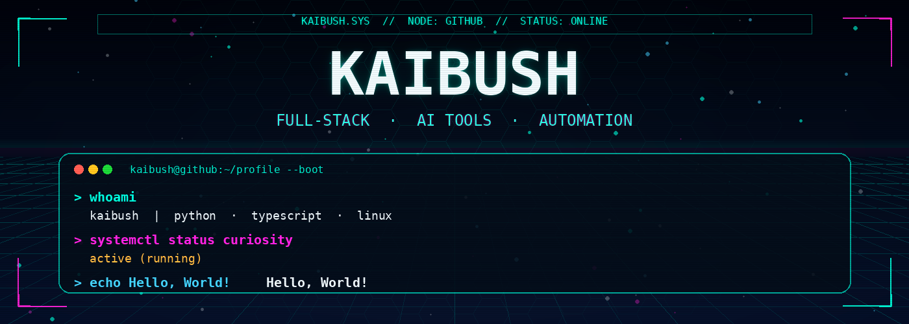
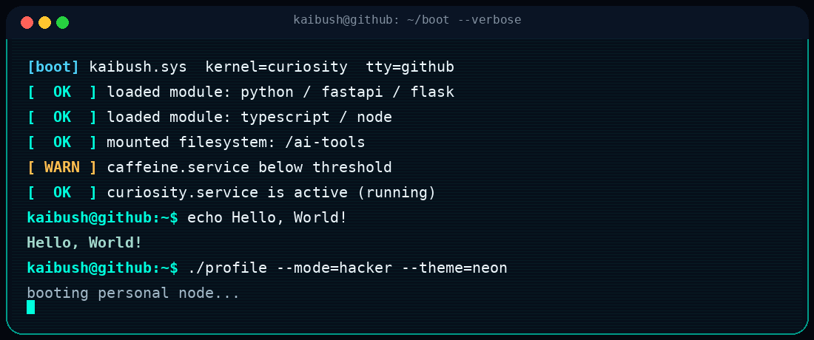
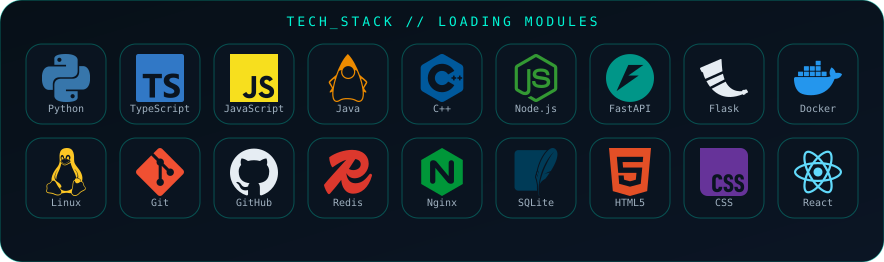
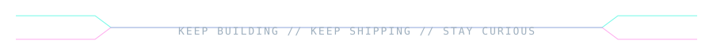

<div align="center">
  
</div>

<p align="center">
  
</p>

<p align="center">
  
  
  
  
</p>

<p align="center">
  
</p>

<div align="center">
  
</div>

<p align="center">
  
</p>

## `~/whoami`

```python
class Engineer:
    handle = "kaibush"
    role = ["full-stack", "ai tools", "automation"]
    stack = ["python", "typescript", "linux"]
    currently = "shipping model infra, register pipelines, and developer UX"
    loop = "build -> break -> measure -> ship"

    def status(self) -> str:
        return "curiosity.service is active (running)"
```

写代码、做工具、盯系统。长期在 **Python / TypeScript / Linux** 这条链路上工作，最近的主线是 AI 接入、鉴权流水线和能真正上线的小产品。

- 🔭 正在做：Grok 工具链、模型质量观测、开发者工作流
- 🧠 感兴趣：自动化、搜索、终端体验、能跑在生产里的 AI
- 🐧 出没：GitHub / [Linux.do](https://linux.do)
- 📫 联系：[kaibush@163.com](mailto:kaibush@163.com)

<p align="center">
  <a href="https://github.com/kaibush"></a>
  <a href="mailto:kaibush@163.com"></a>
  <a href="https://linux.do"></a>
</p>

## `~/modules`

<p align="center">
  
</p>

## `~/projects --featured`

<p align="center">
  <a href="https://github.com/kaibush/grok-register">
    
  </a>
  <a href="https://github.com/kaibush/grok-iq">
    
  </a>
</p>

<p align="center">
  <a href="https://github.com/kaibush/tk-exam-paper">
    
  </a>
  <a href="https://github.com/kaibush/flask-search-ui">
    
  </a>
</p>

| repo | signal | stack |
| :--- | :--- | :--- |
| [grok-register](https://github.com/kaibush/grok-register) | GrokFree 注册机，输出 CPA / grok2api / sub2api 鉴权文件 | Python · TypeScript |
| [grok-iq](https://github.com/kaibush/grok-iq) | grok 4.5 / 4.6 free 模型降智检测，可和注册机联动 | TypeScript · Python |
| [tk-exam-paper](https://github.com/kaibush/tk-exam-paper) | 组卷网爬取与自动出卷 | Python |
| [flask-search-ui](https://github.com/kaibush/flask-search-ui) | 搜索界面实验 | HTML · CSS · JS |
| [linuxdo-peek](https://github.com/kaibush/linuxdo-peek) | Linux.do 阅读助手 | JavaScript |
| [codex-omni](https://github.com/kaibush/codex-omni) | 本地 coding agent 实验场 | TypeScript |

## `~/stats`

<p align="center">
  
</p>

<p align="center">
  
  
</p>

<p align="center">
  
</p>

<p align="center">
  
  
</p>

## `~/contrib --animate`

<p align="center">
  <picture>
    <source media="(prefers-color-scheme: dark)" srcset="./dist/github-snake-dark.svg">
    <source media="(prefers-color-scheme: light)" srcset="./dist/github-snake.svg">
    
  </picture>
</p>

<p align="center">
  
</p>

<p align="center">
  <i>system online · keep shipping · stay curious</i>
</p>
